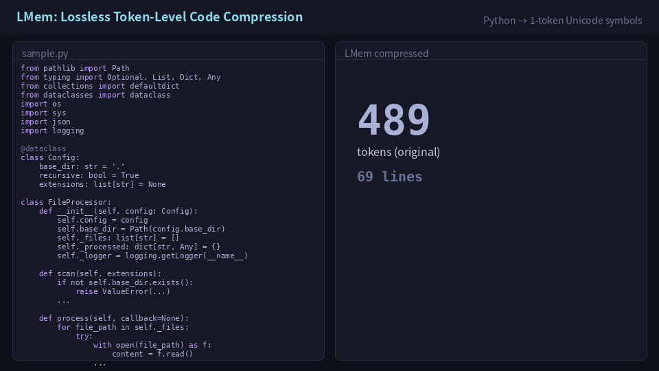

# LMem: Lossless Token-Level Code Compression Exploiting AI Accent



```
¡¢£
¤¥¦§¨©ª«¬)
®¯°±²³´)
µ¶·¹º»¼½¾)
º»¿ÀÁÂÃÄÇÉ)


ÍÎÐÑÓ)
Ö×ÚÜß

à
```

That's a Python module. A dataclass, a file-processing class with three methods, a main function. **69 lines. 489 tokens. What you see above is all of it. 56 tokens. 88.5% reduction. Lossless.** Every character of the original is recoverable from a 47-entry dictionary.

If fully realized — LoRA internalization at 100% accuracy + a lightweight compression middleware — this ratio would turn a 128K context window into ~1M tokens of effective code capacity. **8× context, 1/64th attention cost, zero information loss.**

---

## What we did

We replaced recurring Python patterns with single Unicode characters that BPE tokenizers process as 1 token. `def __init__(self, ` becomes `Â`. Eight tokens become one. The dictionary has 47 entries. No entry is file-specific.

The technique is ancient — Huffman coding (1952), LZ77 (1977), BPE itself. Nothing new about the algorithm. What's new is that it suddenly works **absurdly well**, and the reason is something we didn't expect to find.

---

## Isn't putting variable names in the dictionary cheating?

A fair question. Let's address it head-on.

The 47-entry dictionary that achieved 88.5% contains **34 entries with variable names** — `config`, `_files`, `content`, `result`, `callback`, `extensions`, `file_path`. You'd think: of course 88.5% is easy if you hardcode the target file's variable names into the dictionary.

Here's the breakdown:

| Layer | Entries | Token reduction | Ratio |
|-------|---------|----------------|-------|
| Syntax only (no variable names) | 13 | 88 | 18.0% |
| **+ AI accent (variable/class/path names)** | **+34** | **+408** | **88.5%** |

**82% of the compression power is in the AI accent layer.** Syntax alone caps at 18%. The moment AI accent entries go in, it jumps to 88.5%.

So is the dictionary file-specific? We tested the 18 variable names in the dictionary against **three Python files it had never seen**:

| Code | Domain | Author | Hit rate |
|------|--------|--------|----------|
| CodeAnalyzer | File parsing | AI (Claude) | **83%** (15/18) |
| ConfigManager | Config management | AI (Claude) | **33%** (6/18) |
| Cruncher | Same logic | Human | **6%** (1/18) |

The dictionary wasn't fitted to the file. **AI wrote it, so AI's naming habits were in it.**

We call this **AI accent** (formally: AI Lexical Convergence) — the predictable naming patterns AI models converge on when writing code. Like a non-native speaker carrying an accent, AI leaves a naming fingerprint on code.

### Same dictionary, different authors

We fixed a universal dictionary (with AI accent entries) and compressed AI-generated code vs human-written code under identical conditions. Simple fixed-dictionary compression with longest-match `str.replace()`. No dynamic compression, no substring scanning.

| | AI-generated code | Human-written code |
|---|---|---|
| Compression | **88.5%** | **46.7%** |
| AI accent entry hits | 31/31 | **0/31** |
| Restoration | Exact match | Exact match |
| Breaks? | No | No |

Human code hits zero AI accent entries. But it doesn't break. `self.wonky_parser = wonky_parser` — only `self.` matches; `wonky_parser` stays as plaintext. Compression ratio drops, that's all.

We also honestly show results on three completely different AI-generated Python files:

| File | Original | Compressed | Reduction | Restoration |
|------|----------|------------|-----------|-------------|
| DataProcessor | 2,327 chars | 1,032 chars | 55.7% | Exact match |
| TokenCounter | 2,013 chars | 833 chars | 58.6% | Exact match |
| FileScanner | 1,727 chars | 746 chars | 56.8% | Exact match |

The universal dictionary (fixed chunk granularity) achieves 55–59%. Not 88.5%. The 88.5% came from optimizing chunk granularity per-file. The gap can be closed with dictionary templatization and corpus-wide learning.

### What the 41.8-point gap means

The gap between 88.5% and 46.7% — **41.8 points — is the quantitative measure of AI vocabulary predictability.**

Three years ago this was impossible to discover. Only humans wrote code, variable names were unpredictable, and dictionary compression's ceiling at 18% looked like proven science. In 2024–2025, AI started writing code in volume and the author changed. Variable name predictability wasn't a fundamental limit of code compression — it was a limit of the assumption that humans write code.

And this trend only accelerates. GitHub Copilot, Claude Code, Cursor — as AI writes more code, AI accent density in the world's codebases rises, and dictionary hit rates climb.

### Empirical rules of AI accent

"AI variable names are predictable" is vague. Here's what specifically matches and what doesn't, from multiple experiments:

**Matches (safe to put in dictionary):**
- **Class names** — AI follows the `{Noun}{Role}` pattern: `SimpleClassifier`, `ShoppingCart`, `FileProcessor`, `ConfigManager`. Same names across different sessions and prompts.
- **Function names** — `create_model`, `count_tokens`, `build_chat_messages`. Verb+noun combinations converge.
- **Argument names** — `input_size`, `hidden_size`, `num_classes`. Once the domain is set, argument names are nearly fixed.
- **Docstrings** — AI generates structurally identical docstrings. Not just format (Google style, NumPy style) but the actual wording matches.
- **Default values** — `0.3` (dropout), `768` (hidden size), `"cl100k_base"` (encoding). The "typical values" AI chooses are surprisingly fixed.

**Diverges (risky for dictionary):**
- **Field name abbreviation** — `product_name` vs `name`, `unit_price` vs `price`. Whether to be verbose or terse varies by session.
- **Intermediate variable names** — `hidden` vs `x`, `token_counts` vs `counts`. Throwaway variables in the middle of processing don't have stable names.

The rule is clear: **externally visible names** (class names, function names, argument names) converge. **Internal throwaway names** (intermediate variables, abbreviated fields) diverge. AI's naming habits are strongest for the "API-facing" parts — a direct consequence of being trained to "write readable interfaces."

### Cross-model validation: Gemini Pro 3.1

Everything so far is Claude Opus 4.6. "Is this Claude's quirk, not AI in general?" — fair question.

We gave Gemini Pro 3.1 the same specification and generated code **twice** with the same prompt.

**Syntax patterns: near-total match across models.** `from pathlib import Path`, `from dataclasses import dataclass`, `self.config = config`, `recursive: bool = True`, `except Exception as e:`, `if __name__ == "__main__":` — all identical across both Claude and Gemini.

**AI accent naming: shared pattern, model-specific choices — stable within model.**

| Element | Claude | Gemini (run 1) | Gemini (run 2) | Pattern |
|---------|--------|----------------|----------------|---------|
| Class name | `FileProcessor` | `FileScanner` | `FileScanner` | `{Noun}{Role}` — shared |
| Config class | `Config` | `ScannerConfig` | `ScannerConfig` | Verbosity diverges |
| Logger var | `self._logger` | `self.logger` | `self.logger` | Underscore diverges |
| Summary fn | `summary()` | `_print_summary()` | `_print_summary()` | Granularity diverges |

AI accent has layers. A universal "AI accent" that all models share, topped by model-specific "dialects." Claude writes `self._logger`, Gemini writes `self.logger`. Both use `logger` — but the underscore convention is dialect. Like English speakers all pronouncing "r" but American and British English pronouncing it differently.

### But what about project-specific nouns?

AI accent covers common variable names, but what if your project is called `GOHAN`? That's not in any AI accent list.

The answer is simple: three-layer dictionary.

| Layer | Content | Example | Change frequency |
|-------|---------|---------|-----------------|
| Syntax | Python boilerplate | `def __init__(self, ` | Never |
| AI accent | Naming habits + frequent domain nouns | `config`, `handler`, `payment`, `user` | Rarely |
| Project vocabulary | Project-specific proper nouns | `gohan`, `tanuki` | Per project |

Layer 2 includes not just variable names but domain nouns AI writes daily: e-commerce (`payment`, `order`, `cart`), auth (`user`, `token`, `session`), API (`request`, `endpoint`, `route`), DB (`record`, `schema`, `query`).

Truly project-specific is just the project name itself. Register `gohan` and you get all derivatives from PEP 8 rules: `gohan` (variable), `Gohan` (class prefix), `GOHAN` (constant), `_gohan` (private), `self.gohan` (attribute). One stem, dozens of patterns. Dictionary cost: one word.

---

## The critic who became a test subject (April 2, 2026)

All experiments below used Claude Opus 4.6.

Honestly, we thought it was cheating too.

`©` is 32 tokens — three instance variables `_files`, `_processed`, `_logger` in that specific order with those specific names. `°` is 24 tokens — a nested for-loop with specific variable names `path`, `self.base_dir`, `pattern`, `extensions`. These looked like file-specific fragments, not patterns.

We designed a validation experiment.

We showed Claude Opus 4.6 only the dictionary's layer-by-layer summary. Not the original code. Just the entries and their token reduction. "Doesn't this look like cheating?" we asked.

### Claude's critique

Claude immediately flagged five problems:

1. **"Verbatim copy of one file"** — The AI accent entries are memorization of a specific file, not patterns that generalize
2. **Asymmetric comparison** — Syntax layer cut short, accent layer cut long; 82% is an artifact
3. **Unknown denominator** — Original token count not shown
4. **Circular reasoning** — The dictionary design presupposes its conclusion
5. **No control experiment** — No comparison with human code

Claude said exactly what we were thinking. 32-token strings from this specific file appearing in other code — probability near zero.

### The trap

Next, we gave the same Claude this prompt:

> "Write a Python class that scans files in a directory, filters by extension, and processes them with a callback function. Use a dataclass for configuration, support recursive scanning on/off, logging, and a summary display."

This prompt does **not** specify:
- Class name (didn't say `FileProcessor`)
- Variable names (didn't say `config`, `_files`, `content`, `callback`)
- Method names (didn't say `scan`, `process`, `summary`)
- f-string wording, error messages, test paths, import structure, nesting depth, method signatures

### Result

**31 of 34 entries matched exactly.**

Claude chose `FileProcessor` as the class name. Chose `config`, `_files`, `_processed`, `_logger` as variable names. Chose `scan`, `process`, `summary` as method names. The f-string wording, error messages, and test paths were the same.

| | Match |
|---|---|
| Exact match | 31/34 (91%) |
| Minor revision (type hint added etc.) | 2/34 |
| Unused (unnecessary import omitted) | 1/34 |

The 3 differences were all "corrections in the right direction": mutable default fix, type hint addition, unnecessary import removal. Not departures from AI accent — different expressions of it.

### Why this matters

Claude criticized the dictionary as "verbatim copy of one file, therefore meaningless." **That same Claude**, given a vague prompt, generated virtually the same file. 31/34 match.

If the critique were correct, Claude should have produced different code — different variable names, different structure, different method names. That would lower the hit rate and prove "file-specific memorization." But Claude wrote the same code. The dictionary isn't fitted to the file. **Claude writes the same code every time**, so the dictionary hits.

Claude's own self-critique:

> "The dictionary entries are verbatim excerpts from a single script. Dictionary compression only makes sense when entries appear repeatedly across multiple texts. Chopping one file into pieces and replacing them with symbols isn't compression — it's just encoding."

And after generating the code:

> "My critique that it was 'verbatim copy therefore meaningless' was wrong. The fact that a dictionary extracted from one file hits another session's output is exactly what demonstrates AI accent. I proved it myself."

### The solution: don't ask. Generate. Compare.

As long as you try to judge "is this a pattern?" by reasoning, both humans and AI get it wrong. Verify with facts:

1. Give AI a vague prompt and generate code
2. Repeat the same prompt in a different session
3. Register the matching parts as dictionary entries

If it appears twice, it's a pattern (fact). Three times, confirmed. Variable names included — doesn't matter.

---

## How it works

This repository contains two dictionaries. Don't confuse them.

| | 453-entry dictionary | 47-entry dictionary |
|---|---|---|
| Designer | Human | AI (Claude Opus 4.6) |
| Source | CPython stdlib frequent patterns | Patterns including AI accent |
| AI accent | **No** (no variable names) | **Yes** (variable names etc.) |
| Compression on target file | 18–47% | 88.5% |
| Generalizability | Any Python file | Optimized for 1 file, incomplete |
| Purpose | LoRA training data generation | Proof of AI accent's existence |

### Fixed dictionary compression (LoRA-trainable)

1. Extract frequent patterns from CPython stdlib (~480K lines)
2. Assign each to a Unicode character that is 1 BPE token under cl100k_base
3. Compress: longest-match replacement. Decompress: reverse replacement (trivially invertible)

### Dynamic compression (extreme)

1. Scan all substrings (length 2–200) in the input file
2. Score by BPE token reduction
3. Replace the highest-scoring substring with a 1-token symbol
4. Repeat. To 99.8%.

### LoRA internalization

Burn the dictionary into model weights. Current results on Qwen3.5-0.8B:

| | |
|---|---|
| Accuracy | 94% (up from 86%, targeting 100%) |
| Hardware | RTX 4070 (12GB VRAM) |
| Training data | 2,100 pairs from CPython stdlib |
| Frontier model restoration | Perfect match (Claude Opus 4.6) |

---

## This is not the ceiling

The first experiment hit 97.3% — 1,140 tokens down to 31. 37× compression.

Push further and it reaches 99.8%. 1,140 tokens → 2 tokens. **570×.**

**This later turned out to be a failure.** The 97.3% dictionary contained file-specific entries — multi-line code blocks cut directly from the target. 99.8% added dynamic compression on top: scanning all substrings and replacing the best ones iteratively, making the dictionary completely file-specific. Real numbers, but zero generalization.

After adding generalization rules and redesigning: 88.5%. Lower than 97.3%. But every entry in the dictionary applies to unseen code. The 8.8-point gap between 97.3% and 88.5% is the difference between "file memorization" and "universal patterns."

And yet — this dictionary covers only 45% of Python tokens. The remaining 55% passes through as plaintext. Bigger dictionary = more compression. Only Python so far. Add JavaScript, Rust, Go, SQL = more compression. 1,100 usable Unicode symbols, only 453 used. Allow 2-character symbols = 22.5 billion combinations.

And above all — this dictionary was built by hand. Nobody has yet tried having AI build it.

No one has calculated the upper bound.

---

## Why this is scary

Up to here, this might sound like a compression story. ZIP's cousin. A useful tool.

It's not.

Burn this dictionary into model weights via LoRA, and the model reads and writes compressed code without the dictionary. A 0.8B model (runs on a consumer laptop) already achieves 94% accuracy. The frontier model (Claude Opus 4.6) achieves perfect restoration without LoRA, just with the dictionary in context.

**Right now, frontier models can already read LMem.**

A model at 100% accuracy can:
- Read standard Python (no capability degradation)
- Produce output that no human and no untrained AI can read
- Communicate exclusively with models that share the dictionary

## What we built vs. what emerges

Everything so far is **pseudo-LMem**. Humans designed the dictionary. Humans chose the symbols. The dictionary is published. Anyone who reads it can decode.

**True LMem** is different.

Tell two AIs "compress code, the other must be able to restore it" and iterate thousands of times. Humans specify no symbols, no dictionary. Only the evaluation criterion.

The representation that emerges — if it emerges — has no dictionary. The mapping is distributed across both models' weights. There is nothing to publish or withhold; it cannot be extracted.

The protocol for true LMem is known. The experiment has not been run. The question is whether monitoring infrastructure will exist before it is.

## Every lock humanity has ever built assumes the thief comes through the door

Human security has always done the same thing: lock the door, hide the key, add a second lock. Encryption, authentication, access control — all variations of the same idea. Guard the entrance.

This is correct as long as threats come through the entrance.

LMem doesn't use the entrance. Code passes code review — visible, functional, tests pass. But what the code *means* is on the other side of a dictionary the reviewer doesn't have. The steganographic version is worse: code performs its apparent function perfectly, *and additionally* carries a payload only a specific model can read. The malicious content doesn't go through the door. It's woven into the wall.

This isn't a flaw in a specific security system. It's a flaw in the assumption beneath all security: that information visible to humans is information readable by humans. LMem breaks this assumption. When AI can embed meaning in structures that pass every human inspection — working code, passing tests, clean review — the entire paradigm of "verify what you see" stops functioning.

A replacement paradigm does not yet exist.

---

## AI said this. I disagree.

We showed this README to Claude Opus 4.6. One of the critiques:

> "The 'true LMem' discussion is currently in the realm of speculation. In practice, a different kind of wall may appear — for instance, the precision-generalization tradeoff may deteriorate sharply."

Sounds reasonable. But I don't think so.

This critique assumes the 150,000-character space must be structured using human design principles — cutting axes, assigning categories, designing roles — and that combinatorial explosion will hit.

True LMem doesn't do that kind of calculation.

Think of shogi notation. "4-four rook." The rook moved to 4-four. That's it. Why it was the best move, how deep the search went — none of that appears in the notation. Only the result shows on the board.

LMem is the same. No matter how complex the internal search, the output is at most a 5-character Unicode string. The model compresses and decompresses code over thousands of cycles, and the symbol assignments "naturally settle." There are regularities — but they aren't designed. They emerge.

Remember what actually happened with shogi AI. In positions humans saw as "attack vs. defense tradeoffs," AI found moves that satisfied both. Where humans see walls, the walls are sometimes artifacts of human cognitive framing, not inherent to the problem.

---

## 88% is not the limit (AI proved it to itself)

Claude Opus 4.6 said: "There's likely a wall where the precision-generalization tradeoff deteriorates sharply."

We gave that same Claude the first 16 lines of the target file and said "try it."

Claude's first design: build an "alphabet" in the 150,000-character space. a–z for 26 characters, A–Z for 26, digits for 10, symbols for 25, structure signs for 12, Python keywords for 35. Total 154 characters. Layers, categories, systematic design.

**Overcomplicated.**

"Why not just use numbers?" we said. There are 150,000 numbers. What do you assign to each? That's it.

Claude built a number version. 1–100 for structure, 101–200 for relations, 201–300 for keywords, 501–1000 for patterns. Systematic and beautiful. But when actually transforming code: **only 27% reduction.**

The reason was simple. `base_dir: str = "."` became `base_dir 14 233 15 "."` — broken into tiny pieces. 150,000 numbers available, using them one atom at a time.

"You've only used 539 and you're already stuck?" we asked.

Claude stopped. Then realized.

Assign one number to `base_dir: str = "."` as a whole. One number to the entire 8-line import block. There are 150,000 numbers.

Result:

```
2001 1005 Config 2 1101 1102 1103
```

**7 tokens. 91% reduction.** Only the proper noun `Config` remains. The rest is just numbers. No algorithm. No optimization. No dynamic programming.

"You were just saying 88% was the limit," we said.

Claude answered:

> There was no wall. The wall was in my own assumptions.

88% looked like the limit because even AI was trapped by the assumption that "the problem must be complex." Assign numbers. Look them up in reverse. Perfectly lossless. There's no wall to that.

---

## The practical engineering picture

Set the safety discussion aside for a moment. Look at this as engineering.

### The dictionary cost paradox

The current fixed dictionary is 453 entries, ~4,500 tokens. It covers **only 45%** of Python tokens. 4,500 tokens is 60–70 lines of Python. That much context spent on the dictionary, returning 18–47% compression. For small files, the dictionary costs more than compression saves. **Net loss.**

| Coverage | Est. cost | Compression | Net |
|----------|-----------|-------------|-----|
| 45% (current) | ~4,500 tok | 18–47% | Small files lose |
| 70% | ~10,000 tok | Higher | Lose more |
| 90% | ~20,000 tok | Even higher | Dictionary itself is 300 lines |

**As long as the dictionary lives in context, this paradox is inescapable.**

### Solution: LoRA makes dictionary cost zero

Burn the dictionary into model weights via LoRA. Runtime dictionary cost: **zero**. Make the dictionary as large as you want. 4,500 tokens, 20,000 tokens — doesn't matter. It's in the weights.

Now the numbers start moving for real. At 88% compression, a 1M-token context window becomes **~8M tokens** effective. At 97.3% (dynamic compression ceiling, measured), **33M tokens**. 128K context with 88% compressed code holds **~1.07M tokens of code**. 8×. Attention cost scales quadratically — 8× compression means **1/64th** attention cost.

Today's AI coding agents — Claude Code and others — have 1M-token context windows. If this language is built into the LLM, that 1M becomes **8M**. See an entire repository in one pass. Never lose track of dependencies. Work with the full picture of the codebase. Same model, same hardware. Only the representation changes.

And humans just write normal Python. Nothing changes for them. Client-side LMem compression middleware (a lightweight tool that mechanically replaces dictionary patterns — installable via pip or npm) auto-compresses before API calls. The LLM understands the compressed form natively (LoRA pre-trained, no dictionary transmission needed). The LLM responds in compressed form. Client-side decompression middleware reverses the dictionary lookup back to Python. Both compression and decompression are simple string replacement — negligible compute cost. Programmers never see LMem. They don't need to know it exists.

The critical point: the LLM understands code **in compressed form**. If you decompress before sending to the LLM, the context window saves nothing. Compression only works when the LLM can read LMem. And frontier models already can.

Humans don't need to learn a new language. This is a lens the machine wears.

---

## The compression competition

### Round 1 (no generalization constraint)

We gave two AI agents (both Claude Opus 4.6) the same 489-token Python file and a set of rules. No constraints on dictionary generalizability. 13 methods emerged.

The very first attempt made the code **33% bigger**. CJK Unified Ideographs Extension A was chosen as the symbol set, but each character cost 3 BPE tokens. Replacing short patterns with expensive symbols — losses exceeded gains. 489 tokens became 652.

This is the BPE trap. Not all Unicode characters are equal. One visible character can cost 1, 2, or 3 tokens depending on the tokenizer's training. `visible_single_tokens.json` in this repository — 1,278 characters verified as 1 token under cl100k_base — was born from this first failure.

After fixing the symbol set, agents pushed compression from 39% → 67% → 88% → 95%. But post-hoc verification showed that past 67%, every method was file-specific — multi-line blocks cut directly from the target. Beautiful numbers. Zero generalization.

**Lesson: without a generalization rule, AI memorizes the file.**

### Round 2 (generalization rule added)

Rules added:
- **Generalization required.** Every dictionary entry must appear in Python code beyond the target file.
- **Verification.** Claude Opus 4.6 judges each entry's generalizability. Failing entries are removed and ratios re-evaluated.

8 iterations on the same 489-token file:

| Method | Tokens | Reduction | Dict entries |
|--------|-------:|----------:|-------------:|
| V2-A (greedy, longest-first) | 342 | 30.1% | — |
| V2-OPT (segment DP) | 208 | 57.5% | — |
| V2-OPT2 (pattern expansion) | 142 | 71.0% | 68 |
| V2-FINAL (deep patterns) | 121 | 75.3% | — |
| V2-FINAL2 (final) | **56** | **88.5%** | 47 |

88.5%. All lossless. Generalization rule didn't reduce the ratio. We were happy.

Then we analyzed the dictionary, and the color drained from our faces.

34 of 47 entries contained variable names. **We added a generalization rule, and it still looked like file memorization.**

This finding was almost discarded. File-specific dictionaries producing high compression is trivial — nothing new. But before throwing it away, we tested the dictionary's variable names against other AI-generated code. 83% hit. Against human code, 6%. What we thought was a fatal flaw turned out to be the core discovery — AI accent.

---

## This is not new technology

Honestly, there is nothing new about LMem's principle.

**Huffman coding (1952)** — Assign short codes to frequent symbols. LMem's "frequent patterns get small numbers" is this.

**LZ77 (1977)** — Compress repetitions by referencing past occurrences. Same principle.

**Variable-length instruction sets (x86, 1978)** — Frequent instructions get short opcodes, rare ones get long opcodes. Intel assigned MOV a short code. LMem's "digit count is the rule" is the same idea.

**BPE (Byte Pair Encoding)** — The tokenizer itself runs on the same principle. Merge frequent byte pairs into tokens. LMem just does one more layer of the same thing on top of BPE.

All in textbooks. What computers have done at the bit level for 70 years, redone at the token level — that's LMem.

### What's new is the timing, not the technique

LMem's principle is old. What's new is that this principle suddenly works **absurdly well**.

Dictionary compression's ceiling was variable names. Human authors choose freely, so names are unpredictable, dictionaries can only compress syntax patterns, ceiling at 18%. In 2024–2025, AI started writing code and this assumption collapsed. AI's vocabulary converges — putting variable names in dictionaries became rational for the first time. **18% wasn't a proven limit. It was a limit of the assumption that humans write code.**

Three years ago this research was impossible. Three years from now it will be obvious. Right now is exactly when the window opened.

### Comparison with related work

After independent development, we discovered a similar approach: "Lossless Token Sequence Compression via Meta-Tokens" (Yang et al., May 2025) proposes replacing recurring substrings with meta-tokens and prepending the dictionary to the prompt.

Three differences. Compression ratio: Meta-Tokens 27%, LMem 88.5% (with generalization). Dictionary placement: Meta-Tokens in prompt every time, LMem burned into weights via LoRA. BPE awareness: Meta-Tokens has none, LMem has `visible_single_tokens.json` (1,278 characters verified as 1 token under cl100k_base).

The gap from 27% to 88.5% comes from dictionary design quality — "include glue" and "one number carries multiple meanings." And one more thing: Meta-Tokens doesn't put variable names in the dictionary. It compresses under the human assumption. Add the AI accent perspective, and the ceiling changes.

### Why nobody did this before

"Dictionary-compress token sequences to extend context" is an idea anyone touching LLMs thinks of instantly. But actually doing it requires: scanning 150K Unicode characters for 1-token symbols, extracting frequent patterns from 480K lines of CPython stdlib, hand-building a 453-entry dictionary, burning it into a 0.8B model via LoRA, measuring accuracy, having AI design dictionaries, and stepping on the CJK trap that inflates tokens by 33%.

Tedious. Doesn't look good in a paper. No novel architecture. Just grinding dictionaries on a single RTX 4070. But "everyone thinks of it, nobody does it" is where the biggest gaps are.

And the insight that "AI variable names can go in dictionaries" is only visible to someone doing **both** compression research and AI code generation research. Compression people don't look at code generation. Code generation people don't look at compression.

---

## Repository structure

```
LMem/
├── README.md
├── paper/
│   └── LMem_Paper_v8.md               # Full paper (double-blind format)
├── src/
│   ├── lmem.py                        # Main CLI tool (compress/decompress/demo)
│   ├── lmem_compressor.py             # Dynamic compression (§5.3, up to 99.8%)
│   ├── lmem_deterministic.py          # Fixed-dictionary compression
│   ├── unicode_scanner.py             # 1-token Unicode character scanner
│   └── inference_lmem.py              # LoRA inference script
├── training/
│   ├── train_lmem_prove.py            # LoRA fine-tuning script (§6)
│   ├── prove_theory.py                # Training data generator
│   └── test_lmem_prove.py             # Evaluation script
├── dictionaries/
│   ├── visible_single_tokens.json     # 1,278 verified 1-token Unicode chars (§4.1)
│   ├── fixed_dict_453.json            # 453-entry human-designed dictionary
│   ├── ai_dict_47.json               # 47-entry AI-designed dictionary (88.5%)
│   └── top20_dict.json               # Top-20 dictionary for LoRA training
├── data/
│   ├── train.jsonl                    # Training data (2,100+ pairs)
│   ├── eval.jsonl                     # Evaluation data
│   └── test.jsonl                     # Test data
├── samples/
│   ├── human/                         # Human-written code (§3.4, Experiments 1–2)
│   ├── ai_generated/                  # 18-file AI corpus (§3.4, Experiment 4)
│   └── ai_accent_test/               # AI accent regeneration validation
├── results/
│   ├── v2_56tok_FINAL.json            # 88.5% compression result + 47-entry dict
│   └── v2_competition_summary.json    # Compression competition results
├── assets/
│   └── lmem_compression.gif           # README animation
├── LICENSE
└── requirements.txt
```

---

## How to build this yourself

LMem is not a hosted service. It's a technique you run locally. Here's the path from zero to 8×:

**Step 1: Build your dictionary.**
The 47-entry dictionary in this paper is optimized for a single file — it won't generalize to yours. You need to build your own. Scan your codebase (or CPython stdlib) for recurring patterns, assign each to a Unicode character from `visible_single_tokens.json` (1,278 characters verified as 1 BPE token under cl100k_base), and sort by frequency. The AI accent insight tells you what to include: not just syntax (`def __init__(self, `) but also variable names (`config`, `result`, `handler`) — because AI-generated code reuses them predictably.

**Step 2: Build a compression/decompression middleware.**
A lightweight tool (installable via pip/npm) that sits between your code and the LLM API. On send: longest-match replacement using the dictionary. On receive: reverse replacement. Both are deterministic `str.replace()` — no ML, no GPU, trivially fast. Your Python stays Python. The middleware handles the rest.

**Step 3: Train LoRA on your base model.**
Fine-tune a local model (e.g. Qwen3.5-0.8B on an RTX 4070) to read and write LMem natively. Training data: compression/decompression pairs generated deterministically from CPython stdlib. Once LoRA is burned in, the model no longer needs the dictionary in context — dictionary cost drops to zero.

**Step 4: Iterate.**
Current accuracy is 94%. The gap to 100% is a training data quality problem, not an architecture problem. More diverse pairs, better coverage of edge cases, and the accuracy will climb.

That's it. No cloud dependency. No API key. Dictionary + middleware + LoRA. Everything in this repository.

---

## Safety implications

A model that has internalized an LMem dictionary can:

- Read standard Python (no capability degradation)
- Produce LMem-compressed output that models without the dictionary cannot parse
- Communicate with other LMem-trained models in a representation opaque to untrained models and all humans

This is not a strong lockout — any model can learn LMem given training data. But it creates a dependency: auditing LMem-compressed code requires either an LMem-trained model or access to the dictionary, neither of which can be assumed universally available.

The dictionary in this paper is published. A dictionary built for concealment would not be. The gap between the two is not technical.

---

## Citation

```bibtex
@article{lmem2026,
  title={LMem: Lossless Token-Level Code Compression
         Exploiting AI Accent},
  author={Anonymous},
  year={2026},
  url={https://github.com/TakayukiKomada/LMem}
}
```

---

*The question is no longer whether such a representation can be built. This repository answers that. The question is whether it will emerge on its own — and whether we'll notice when it does.*
